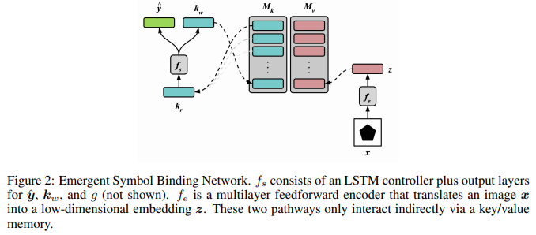

</img>

## ESBN-pytorch (wip)

Usable implementation of <a href="https://arxiv.org/abs/2012.14601">Emerging Symbol Binding Network</a> (ESBN), in Pytorch.

## Citations

```bibtex
@misc{webb2020emergent,
    title={Emergent Symbols through Binding in External Memory}, 
    author={Taylor W. Webb and Ishan Sinha and Jonathan D. Cohen},
    year={2020},
    eprint={2012.14601},
    archivePrefix={arXiv},
    primaryClass={cs.AI}
}
```
